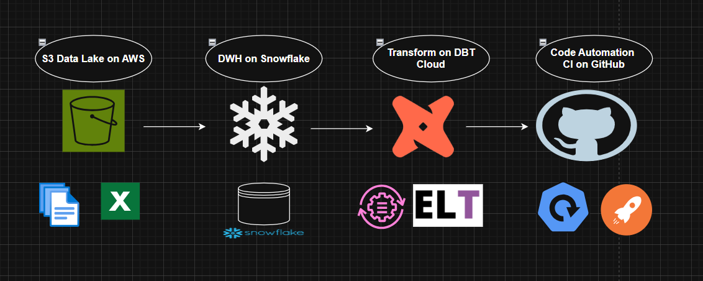
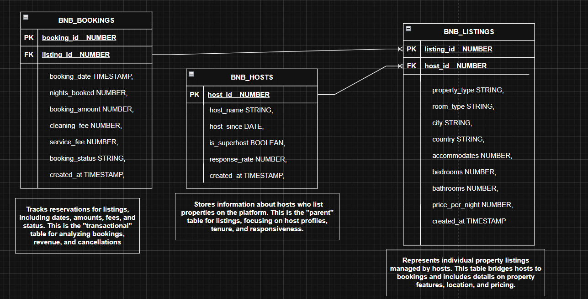
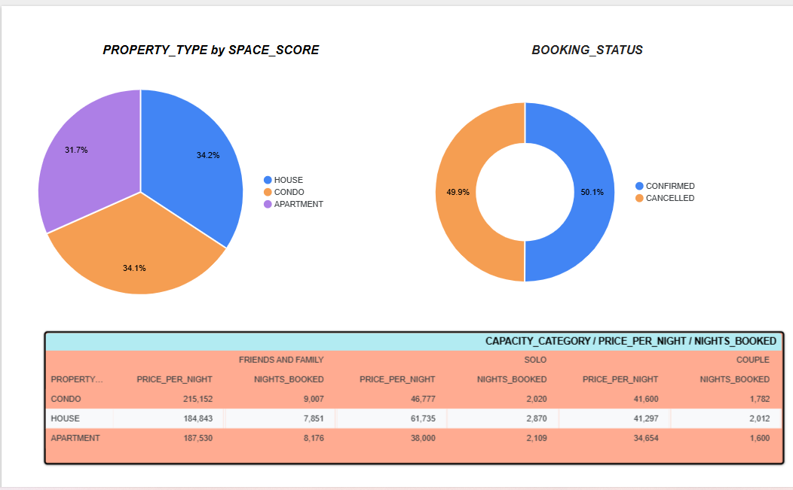

# AWS → Snowflake → dbt Cloud | End-to-End Data Engineering Project

   

---

## 📌 Project Overview

This repository is the complete codebase for an **end-to-end Cloud Data Engineering project** that demonstrates a production-style data pipeline using **AWS S3**, **Snowflake**, **dbt Cloud**, and **Looker**.

The project covers the full data journey — from raw file ingestion through cloud object storage, to governed staging in Snowflake, through a layered transformation architecture in dbt Cloud following the **Medallion Architecture** pattern (Raw → Enriched → Mart), and finally surfaced as interactive dashboards in **Looker**.

---

## 🏗️ Architecture Overview

```
┌─────────────────────────────────────────────────────────────────────────┐
│                          DATA PIPELINE FLOW                             │
│                                                                         │
│  ┌──────────┐    ┌──────────────┐    ┌───────────────────────────────┐  │
│  │  Raw CSV │───▶│   AWS S3     │───▶│         Snowflake             │  │
│  │  Files   │    │  (Storage)   │    │                               │  │
│  └──────────┘    └──────────────┘    │  Storage Integration          │  │
│                        │             │  External Stage               │  │
│                        │             │  CSV File Format              │  │
│                   IAM Role           │  COPY INTO → Staging Tables   │  │
│                   Setup              └──────────────┬────────────────┘  │
│                                                     │                   │
│                                                     ▼                   │
│                                      ┌──────────────────────────────┐   │
│                                      │        dbt Cloud             │   │
│                                      │                              │   │
│                                      │  ┌──────────────────────┐   │   │
│                                      │  │  RAW Layer           │   │   │
│                                      │  │  (Source Models)     │   │   │
│                                      │  └──────────┬───────────┘   │   │
│                                      │             │               │   │
│                                      │  ┌──────────▼───────────┐   │   │
│                                      │  │  ENRICHED Layer      │   │   │
│                                      │  │  (Macros + Logic)    │   │   │
│                                      │  └──────────┬───────────┘   │   │
│                                      │             │               │   │
│                                      │  ┌──────────▼───────────┐   │   │
│                                      │  │  MART Layer          │   │   │
│                                      │  │  (Dim Models +       │   │   │
│                                      │  │   SCD Type 2 via     │   │   │
│                                      │  │   dbt Snapshots)     │   │   │
│                                      │  └──────────────────────┘   │   │
│                                      └──────────────┬───────────────┘  │
│                                                     │                   │
│                                                     ▼                   │
│                                      ┌──────────────────────────────┐   │
│                                      │     Looker (BI Reporting)    │   │
│                                      │     Connected to Snowflake   │   │
│                                      └──────────────────────────────┘   │
└─────────────────────────────────────────────────────────────────────────┘




```

---

## 🛠️ Tech Stack

| Layer | Tool / Service | Purpose |
|---|---|---|
| Cloud Storage | AWS S3 | Raw file landing zone |
| IAM | AWS IAM Role | Secure Snowflake-to-S3 integration |
| Data Warehouse | Snowflake | Staging, storage, and query engine |
| Transformation | dbt Cloud | Data modelling and transformation |
| BI / Reporting | Looker | Dashboard and reporting layer |

---

## 📂 Repository Structure

```
aws-snowflake-dbt-cloud-DE-project/
│
├── aws/                          # AWS setup scripts and configurations
│   └── ...                       # S3 bucket setup, IAM policy definitions
│
├── snowflake/                    # Snowflake SQL scripts
│   └── ...                       # Storage integration, external stage,
│                                 # file format, staging table DDLs,
│                                 # COPY INTO scripts
│
├── dbt/                          # dbt Cloud project
│   ├── models/
│   │   ├── raw/                  # Raw layer — source-aligned models
│   │   ├── enriched/             # Enriched layer — transformed models
│   │   └── mart/                 # Mart layer — dimensional models
│   ├── snapshots/                # dbt Snapshots for SCD Type 2
│   ├── macros/                   # Reusable Jinja macros
│   ├── dbt_project.yml           # dbt project configuration
│   └── profiles.yml              # Snowflake connection profile
│
├── .gitignore
└── README.md
```

## Table Details and Data Understanding



---

## 🚀 Pipeline Walkthrough

### Step 1 — AWS S3: Raw File Landing Zone

Raw source data files (CSV format) are uploaded into a designated folder within an **AWS S3 bucket**. This bucket acts as the entry point for all incoming data before it is loaded into Snowflake.

- S3 bucket created with a structured folder hierarchy for raw file ingestion
- CSV files are dropped into the raw folder, serving as the source of truth for ingestion

---

### Step 2 — AWS IAM Role Setup for Snowflake Integration

To allow Snowflake to securely read from S3, a dedicated **AWS IAM Role** is created and configured.

- IAM Role is created with an S3 read policy scoped to the specific bucket
- The Trust Relationship is configured to allow Snowflake's AWS account to assume the role
- This follows the AWS External ID pattern for secure cross-account access

---

### Step 3 — Snowflake Storage Integration

A **Snowflake Storage Integration** object is created to establish a trusted connection between Snowflake and the AWS S3 bucket without exposing AWS credentials.

```sql
CREATE STORAGE INTEGRATION s3_integration
  TYPE = EXTERNAL_STAGE
  STORAGE_PROVIDER = 'S3'
  ENABLED = TRUE
  STORAGE_AWS_ROLE_ARN = '<iam_role_arn>'
  STORAGE_ALLOWED_LOCATIONS = ('s3://<bucket-name>/<path>/');
```

After creation, Snowflake generates an `AWS_IAM_USER_ARN` and `AWS_EXTERNAL_ID` which are added back to the IAM Role's Trust Policy to complete the handshake.

---

### Step 4 — External Stage & CSV File Format

An **External Stage** is created in Snowflake pointing to the S3 location via the Storage Integration. A **CSV File Format** is defined and attached to the stage to correctly parse the incoming raw files.

```sql
-- File Format
CREATE FILE FORMAT csv_format
  TYPE = 'CSV'
  FIELD_OPTIONALLY_ENCLOSED_BY = '"'
  SKIP_HEADER = 1
  NULL_IF = ('NULL', 'null', '');

-- External Stage
CREATE STAGE raw_stage
  URL = 's3://<bucket-name>/<path>/'
  STORAGE_INTEGRATION = s3_integration
  FILE_FORMAT = csv_format;
```

---

### Step 5 — Loading Data into Snowflake Staging Tables (COPY INTO)

Data is loaded from the External Stage into **Snowflake Staging Tables** using the `COPY INTO` command. These staging tables serve as the raw landing zone inside Snowflake.

```sql
COPY INTO staging_table
FROM @raw_stage
FILE_FORMAT = (FORMAT_NAME = 'csv_format')
ON_ERROR = 'CONTINUE';
```

The staging tables preserve the raw structure of the source files and act as the foundation for all downstream dbt transformations.

---

### Step 6 — dbt Cloud Integration with Snowflake

**dbt Cloud** is connected to the Snowflake schema containing the staging tables. The dbt project is configured via `dbt_project.yml` and a Snowflake connection profile, enabling dbt to reference and transform the staging tables directly.

- dbt Cloud Studio is used for model development and testing
- The Snowflake schema is registered as a **dbt Source**
- Source freshness checks and schema tests are configured for data quality assurance

---

### Step 7 — Medallion Architecture in dbt Cloud

The transformation layer follows a **three-tier Medallion Architecture**:

#### 🥉 RAW Layer
- Directly references the Snowflake staging tables as dbt sources
- Minimal transformation — column renaming, basic casting, and null handling
- Preserves raw grain for auditability

#### 🥈 ENRICHED Layer
- Business logic and transformations applied using **dbt Macros** for reusability
- Data cleansing, enrichment, and standardization
- Reusable macro patterns abstract repetitive logic (e.g., date formatting, currency conversion, null coalescing)

#### 🥇 MART Layer (Dimensional Modelling)
- Dimensional models built following **Kimball-style dimensional modelling**
- Fact and Dimension tables structured for BI consumption
- **dbt Snapshots** implemented for **SCD Type 2** (Slowly Changing Dimensions) — capturing historical changes with `dbt_valid_from` / `dbt_valid_to` columns
- **Metadata-driven architecture** used to make model configuration dynamic and scalable

---

### Step 8 — dbt Snapshots for SCD Type 2

dbt Snapshots track historical changes to dimension records, enabling **Type 2 Slowly Changing Dimension** behaviour.

```sql

  {{
    config(
      target_schema='snapshots',
      unique_key='customer_id',
      strategy='timestamp',
      updated_at='updated_at'
    )
  }}
  SELECT * FROM {{ ref('enriched_customers') }}

```

This ensures full historical lineage is preserved in the Mart layer for accurate point-in-time reporting.

---

### Step 9 — Looker BI Reporting

**Looker** is connected directly to Snowflake as the reporting and BI layer. LookML models are created to surface the Mart layer dimensional models as interactive dashboards and explorations.

- Snowflake connection configured in Looker using a dedicated service account
- LookML defines dimensions, measures, and explores on top of the dbt Mart models
- Dashboards built for business reporting on top of the fully transformed, governed data




---

## ⚙️ Setup & Deployment Guide

### Prerequisites

- AWS Account with S3 and IAM access
- Snowflake Account (Trial or paid)
- dbt Cloud Account
- Looker Account (or Looker Studio as an alternative)

### 1. AWS Setup

```bash
# 1. Create S3 bucket
# 2. Upload raw CSV files to the designated folder
# 3. Create IAM Role with S3 read permissions
# 4. Note down the IAM Role ARN
```

### 2. Snowflake Setup

Run the scripts in `/snowflake/` in the following order:

```
1. create_storage_integration.sql
2. create_file_format.sql
3. create_external_stage.sql
4. create_staging_tables.sql
5. copy_into_staging.sql
```

### 3. dbt Cloud Setup

```bash
# 1. Connect dbt Cloud to your Snowflake account
# 2. Set the target schema to your Snowflake schema
# 3. Clone this repo and link to dbt Cloud project
# 4. Run: dbt deps
# 5. Run: dbt seed (if applicable)
# 6. Run: dbt run --select raw
# 7. Run: dbt run --select enriched
# 8. Run: dbt snapshot
# 9. Run: dbt run --select mart
# 10. Run: dbt test
```

### 4. Looker Setup

```
1. Add Snowflake as a database connection in Looker
2. Point to the MART schema
3. Build Explores and Dashboards
```

---

---

## 📊 Data Flow Summary

```
CSV Files
   │
   ▼
AWS S3 (Raw Landing)
   │
   │  [IAM Role + Storage Integration]
   ▼
Snowflake External Stage
   │
   │  [COPY INTO]
   ▼
Snowflake Staging Tables
   │
   │  [dbt Sources]
   ▼
dbt RAW Layer
   │
   │  [dbt Models + Macros]
   ▼
dbt ENRICHED Layer
   │
   │  [dbt Models + Snapshots (SCD Type 2)]
   ▼
dbt MART Layer (Dimensional Models)
   │
   │  [Snowflake Connection]
   ▼
Looker Dashboards & Reports
```

---

## 👤 Author

**Sumeet K**
[GitHub Profile](https://github.com/SumeetK42)

